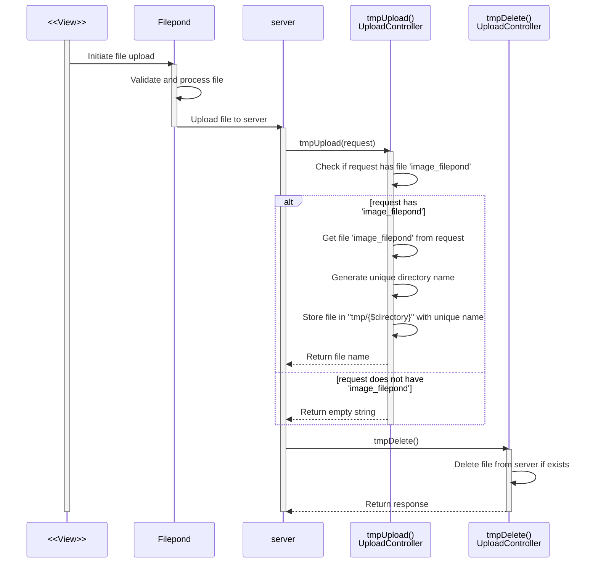
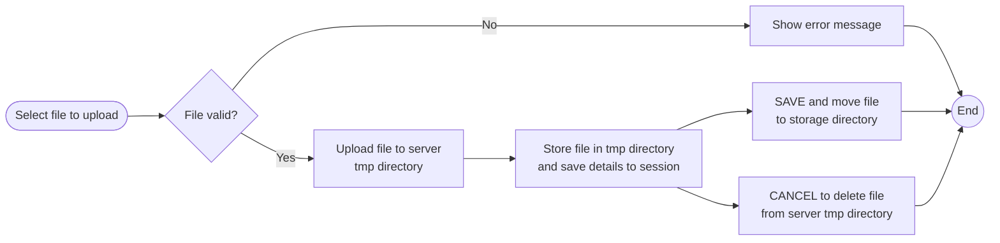

<p align="center"><a href="https://naykel.com.au" target="_blank"></a></p>

# Laravel Cookbook

Laravel cookbook site with a side of Livewire and a sprinkle of Alpine.

## Controller the resource methods

- [x] `index` - Display a listing of the resource. (paginated)
- [ ] `create` - Show the form for creating a new resource.
- [ ] `store` - Store a newly created resource in storage.
- [ ] `show` - Display the specified resource.
- [ ] `edit` - Show the form for editing the specified resource.
- [ ] `update` - Update the specified resource in storage.
- [x] `destroy` - Remove the specified resource from storage.

The `index` page is typically used to list all instances of a certain resource. For example, a
products page. In this case, the `index` page will be a paginated table more like what you would
expect in the admin area of a website.

## Model
- [ ] Define relationships
    - [ ] hasOne
    - [ ] hasMany
    - [ ] belongsTo
    - [ ] belongsToMany
- [ ] Query scope
- [ ] Attribute casting

## Form with all elements
- [ ] Text Input
- [ ] Number Input
- [ ] Date Input
- [ ] Textarea
- [ ] Select
- [ ] Radio
- [ ] Checkbox
- [ ] File
- [ ] Submit
- [ ] Validation
- [ ] Error messages
- [ ] Old input
- [ ] Form method spoofing
    - [ ] PUT
    - [ ] PATCH
    - [ ] DELETE

## Blade Components
- [ ] Filepond
- [ ] Ckeditor
- [ ] Notification
- [ ] Errors

## Middleware
- [ ] Define middleware for authentication/authorization if needed
- [ ] Apply middleware to routes or controller methods

## Authentication
- [ ] Register
- [ ] Login
- [ ] Logout
- [ ] Forgot password
- [ ] Reset password
- [ ] Email verification
- [ ] Two factor authentication

## Policies
- [ ] Define policies for authorization
- [ ] Apply policies to controller methods
- [ ] Apply policies to routes
- [ ] Apply policies to views


### Filepond upload sequence diagram

This diagram shows the sequence of events that occur when a file is uploaded using Filepond. The
diagram only shows the sequence of events from when a user has already selected a file and clicks
the upload button. It does not show the sequence of events that occur when a user selects a file.

```mermaid
sequenceDiagram
    participant view as <<View>>
    participant pond as Filepond
    participant server
    participant store as store()<br>UploadController
    participant destroy as destroy()<br>UploadController

    activate view
        view->>pond: Initiate file upload

        activate pond
            pond->>server: Upload file to server
        deactivate pond

        activate server
            server->>server: Validate and process file
            alt is valid?
                server->>store: store(request)
                activate store
                    store->>store: Check if request has file 'image'
                    alt request has 'image'
                        store->>store: Get file 'image' from request
                        store->>store: Get original file name
                        store->>store: Generate unique folder name
                        store->>store: Store file in "tmp/{$folder}" with original file name
                        store-->>server: Return file name
                    else request does not have 'image'
                        store-->>server: Return empty string
                    end
                deactivate store
            else is not valid?
                server-->>destroy: Delete file from server
                server-->>view: Show Error Message
            end
        deactivate server
    deactivate view
```




### Filepond upload flowchart

This is a high level flowchart of the sequence of events that occur when a file is uploaded using
Filepond. The flowchart only shows the sequence of events from when a user has browsed for a File
and selected it. It does not show the sequence of events that occur when a user clicks the upload
button.




